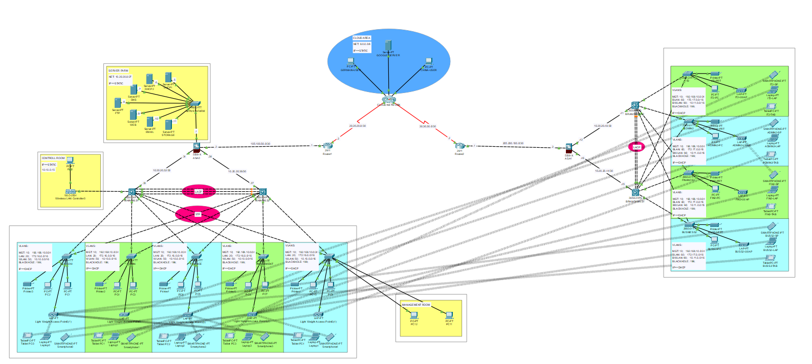

# 🧠 CCNA Project — Multi-Site Network with VLANs, ACLs, DHCP & Wireless

## 📌 Overview
This is a practical networking project built using Cisco Packet Tracer.  
The goal is to simulate a real-world scenario of two branch offices, each with its own network infrastructure and IP range, and connect them securely.

## 🏢 Topology Summary
- *Two separate branches* with different IP ranges
- *DHCP servers* dynamically assigning IPs
- *VLANs* to segment internal traffic (HR, IT, Guest, etc.)
- *Wireless Access Points* for mobile connectivity
- *ACLs* to restrict access between certain devices/subnets
- *Inter-site routing* via static routes

## 🔧 Technologies & Features
- Cisco routers & switches
- VLAN configuration (with trunking)
- DHCP relay & scopes
- ACL (Access Control Lists) for security
- Wireless connectivity (SSID + password)
- DNS for hostname resolution
- Static Routing between sites

## 📷 Topology Diagram

## 📁 Files Included
- network_project.pkt — Cisco Packet Tracer file
- topology.png — Screenshot of the topology
- commands_used.txt — CLI commands used for configuration (optional but useful)

## 🚀 How to Use
1. Open the .pkt file using Cisco Packet Tracer (v8.x or later).
2. Explore VLANs and routing settings.
3. Try pinging across branches and testing ACL rules.
4. Review CLI configs in the provided notes.

## 🧠 Learning Outcomes
- Understanding how to build multi-site networks
- Configuring DHCP, VLANs, wireless, ACLs
- Applying CCNA concepts in a realistic scenario

---

Feel free to fork this project or use it as a reference for your own labs!

Made with 🧠 and 💻 while studying for the CCNA certification.